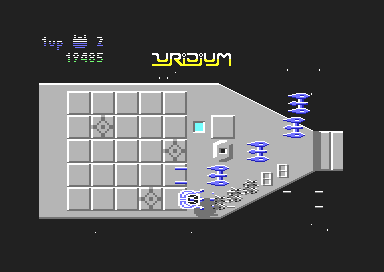
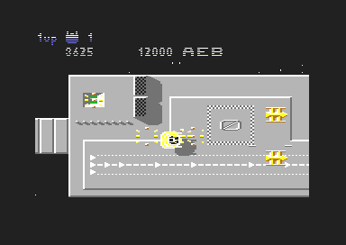
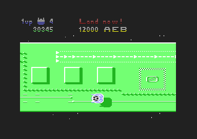
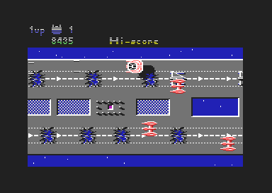
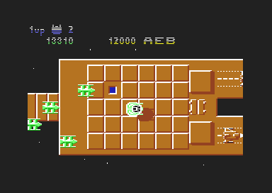
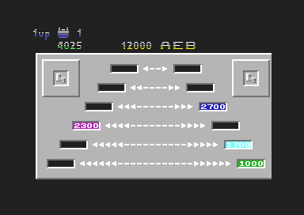

## Scenario

*The solar system is under attack! Enemy Super-Dreadnoughts have been placed in orbit around each of the fifteen planets in this galactic sector.  They are draining mineral resources from the planetary cores for use in their interstellar power units. Each Super-Dreadnought seeks out a different metal for its metal convertor.*

*Your Manta class Space Fighter will be transported to each planet in turn and it is your task to destroy each Dreadnought. First you must attack the defensive screen of enemy fighters, then you must neutralise the majority of surface defences before you land on the Super-Dreadnought's master runway.  Once on board you must pull as many fuel rods as possible from the metal converters before you take off for a final strafing run as the Dreadnought vapourises into the ether.*
- - -
## Playing the Game

Your fighter reverses out of the interplanetary transporter and deploys on a  low-level strafing run. You must avoid meteor shields and communications aerials on the Dreadnought's surface.  The fighter defences deploy in waves. A bonus is awarded after landing if all ships in a wave are destroyed. Attack surface features to score bonus points but beware of the homing mines which materialise over flashing generator ports.

### Destroying a Super-Dreadnought

When the "Land Now" message appears move as soon as possible to the right hand end of the Super-Dreadnought and fly flat over the end of the master runway from left to right. You will land and pass into the fuel rod chamber.

Here you must select your bonus or "Quit" by pressing fire at the right moment. You must quit the chamber before the countdown at the top of the screen reaches zero.  On take off reverse and strafe any remaining surface targets as the Super-Dreadnought vapourises.

### Your Manta Class Fighter

Joystick **UP**/**DOWN** sets the position above the Super-Dreadnought, joystick **LEFT/RIGHT** controls acceleration and deceleration. If your velocity falls too low your fighter performs a half-loop followed by a half-roll so as to face in the opposite direction. This manoeuvre also temporarily increases your height above the surface and may be used to avoid incoming missiles and mines.  Your Manta performs a 90 degree roll if you press and hold **FIRE** whilst moving the joystick **UP** or **DOWN**. This enables you to manoeuvre through restricted spaces.

### Score Table

|Target|Points|
|---|---|
|Small explodeable surface feature|10|
|Large explodeable surface feature|25|
|Enemy ship on runway|100|
|Enemy fighter|100-1000|
|Wave annhilation bonus|100 per wave|

A bonus Manta is awarded every 10,000 points.

- - -
### Game Options

During the titles sequence you may select:

|Key|Action
|---|---|
|f1|One player, one joystick, either port
|f2|Two players sharing one joystick, either port
|f3|Two players, two joysticks
|f5|Increase music volume
|f6|Decrease music volume
|f7|Colour mode
|f8|Monochrome mode

During play:

|Key|Function
|---|---|
|Run/Stop|Pause or resume game
|Clr/Home| Abandon game (whilst paused)

**FIRE** will also resume (unpause) the game.

- - -
### Technical Data

- Fifty cycles per second scrolling to single pixel resolution.
- Three voice music and sound effects.
- Hardware and software sprites.

- - -

## Credits

	Uridium designed and programmed by Andrew Braybrook
	Music written and programmed by Steven Turner
	Name created by Robert 'I thought it really existed' Orchard

